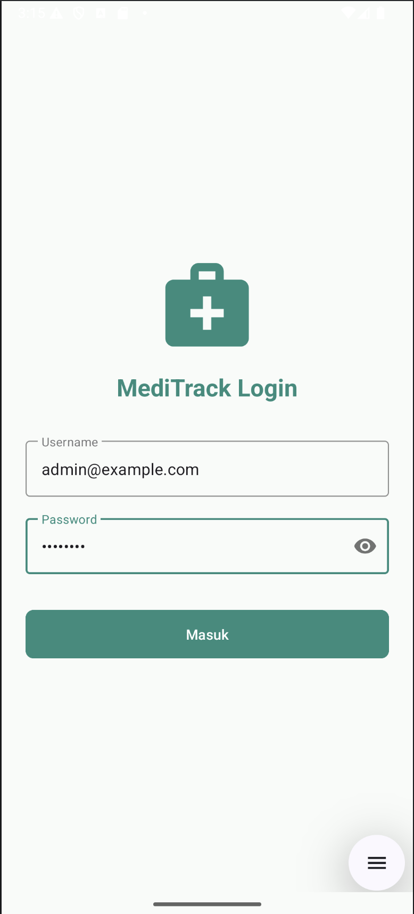
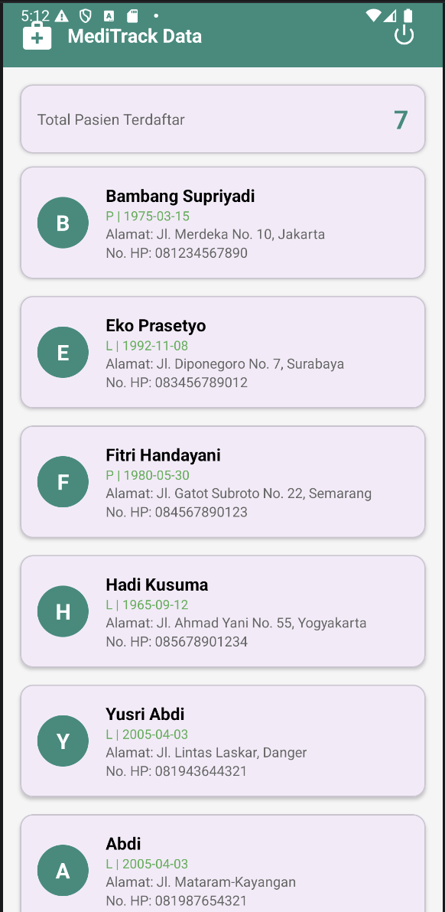

# 🏥 MediTrack - Sistem Manajemen Pasien

MediTrack adalah aplikasi Android modern berbasis **Kotlin** yang dirancang untuk digitalisasi pengelolaan data pasien. Aplikasi ini menggunakan arsitektur yang bersih dan terhubung langsung ke RESTful API untuk autentikasi serta manajemen data real-time.

---

## 📱 Tampilan Aplikasi

| Halaman Login | Daftar Data Pasien |

|---|---|

|  |  |

---

## 🏁 Cara Menjalankan Aplikasi

1. **Clone** repositori ini ke komputer Anda.

2. Pastikan perangkat/emulator memiliki **koneksi internet**.

3. Buka proyek di **Android Studio**.

4. Lakukan **Build > Rebuild Project** untuk sinkronisasi Gradle.

5. Jalankan aplikasi (`Run 'app'`).

6. Gunakan kredensial berikut untuk masuk:

   - **Email:** `admin@example.com`

   - **Password:** `password`

## 🔗 Struktur API

Aplikasi ini terhubung ke backend: `https://api.pahrul.my.id/`

- `POST /api/login` - Mengirim kredensial dan menerima Access Token.

- `GET /api/pasien` - Mengambil list pasien (Wajib menyertakan Header Authorization).

---

## 👤 Penulis

**Zainul Majdi** 🆔 NIM: **F1D02310028** 🎓 Teknologi Informasi, **Universitas Mataram (UNRAM)** *Proyek ini dikembangkan sebagai tugas mata kuliah Pemrograman Perangkat Bergerak.*

---

© 2026 **MediTrack Project**

